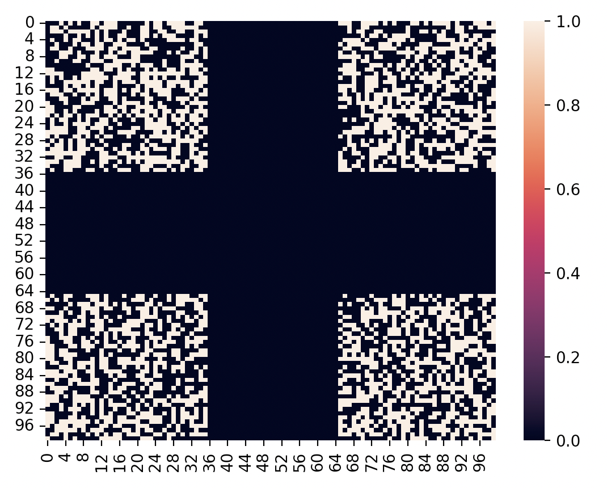
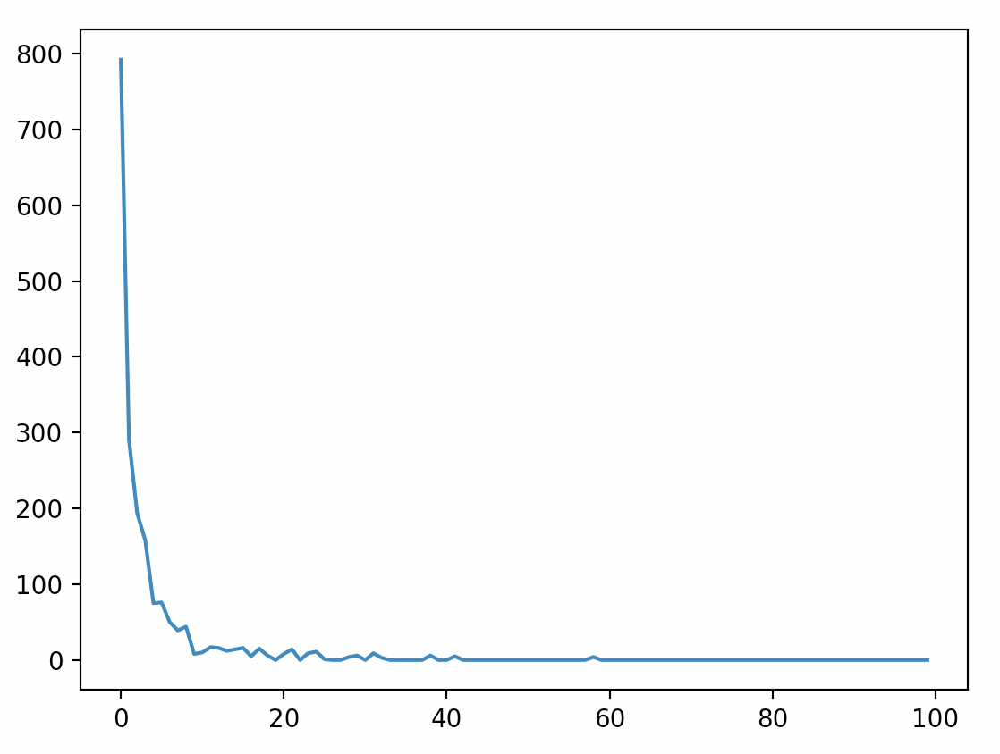
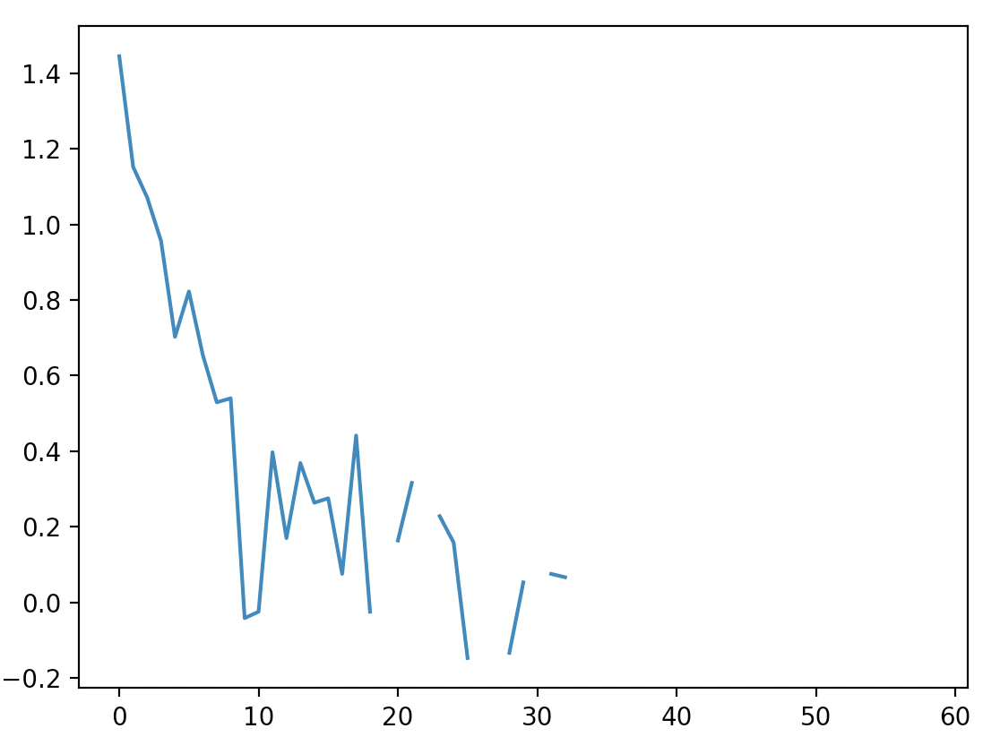
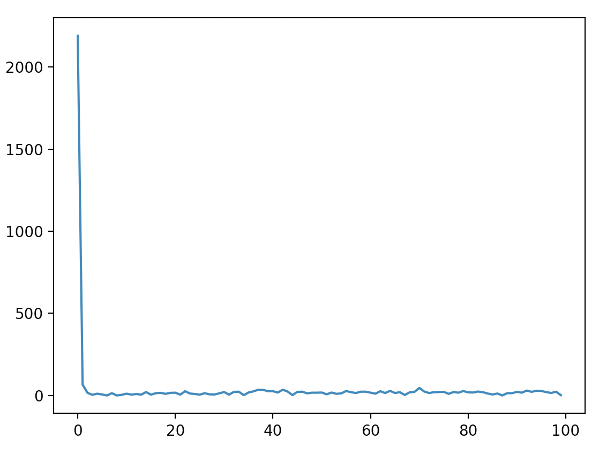
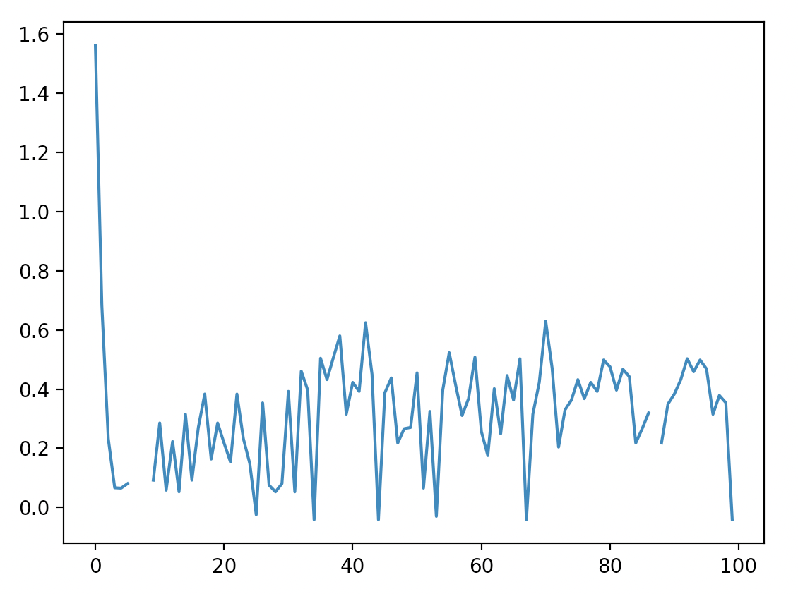
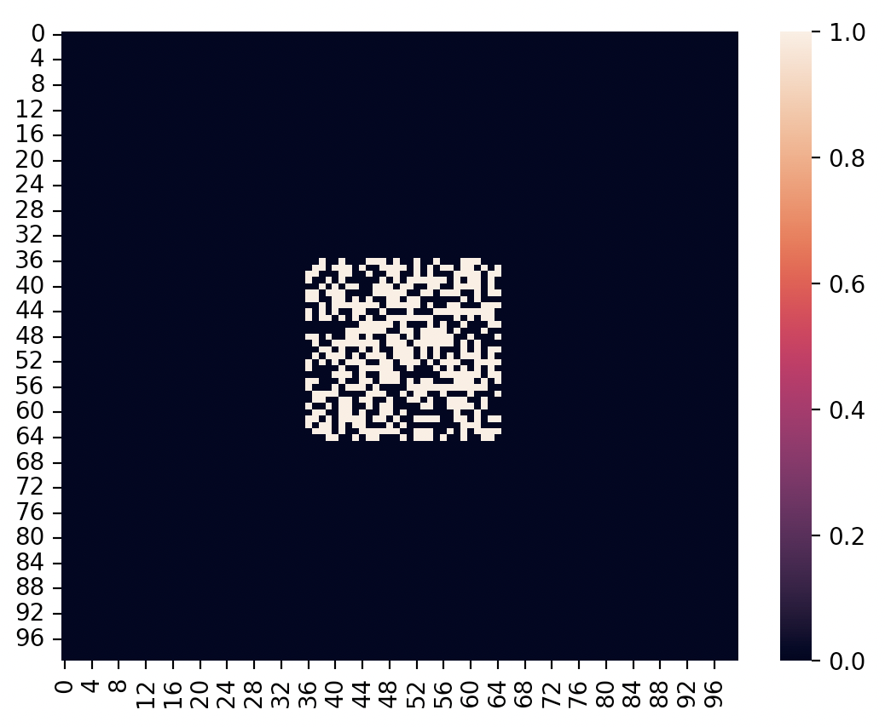
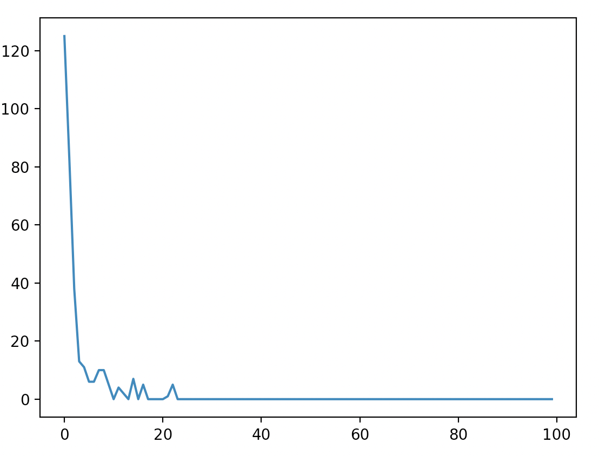
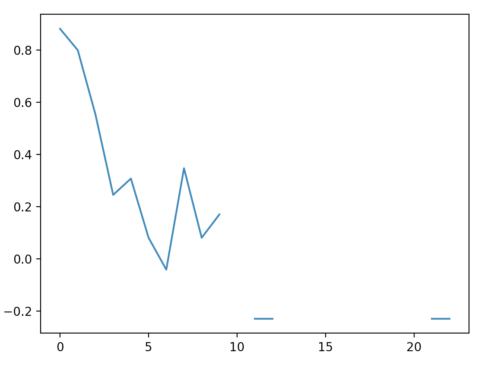
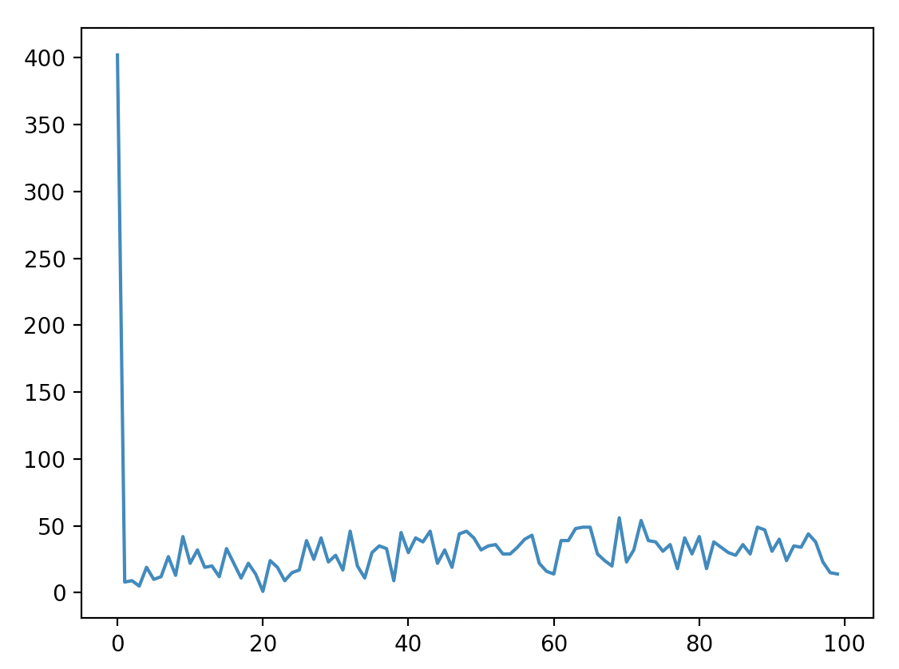
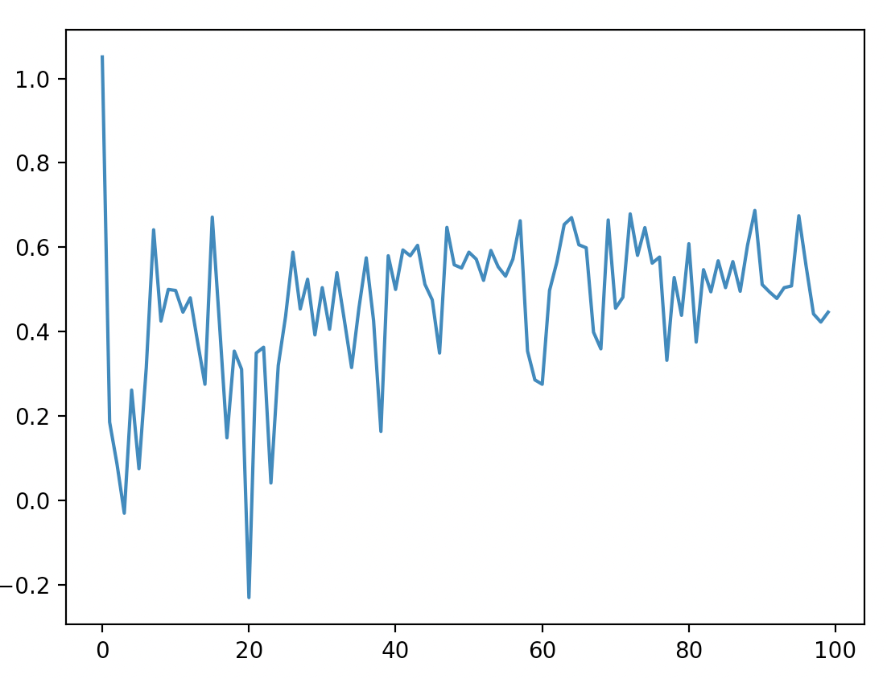

# Avance: Estabilidad y Dimensiones Fractales

Una posible forma de medir estabilidad es contando cuántas celdas se pueden urbanizar conforme pasa el tiempo. Además se puede analizar la dimensión fractal. Se me ocurrió que podría ser de utilidad cómo evoluciona la dimensión fractal según pase el tiempo. A continuación diversas configuraciones:

## Caso 1:

| Tipo           |          |
| -------------- | :------: |
| Configuración  | Esquinas |
| Iteraciones    |   100    |
| Coef Slope     |   0.01   |
| Crit Slope     |   0.01   |
| Coef Diffusion |    1     |
| Coef Spread    |    10    |
| Coef Breed     |    10    |

Config inicial:

Evolución:

<video width="320" height="240" controls>
  <source src="./assets/avance-1/config-1/evolution.mp4" type="video/mp4">
    Your browser does not support the video tag.
</video>

Visualización nuevas celdas:

<video width="320" height="240" controls>
  <source src="./assets/avance-1/config-1/new-cells.mp4" type="video/mp4">
    Your browser does not support the video tag.
</video>

Estabilidad nuevas celdas:

Evolución dimensión fractal:

## Caso 2:

| Tipo           |          |
| -------------- | :------: |
| Configuración  | Esquinas |
| Iteraciones    |   100    |
| Coef Slope     |   0.01   |
| Crit Slope     |   0.01   |
| Coef Diffusion |    25    |
| Coef Spread    |    50    |
| Coef Breed     |    50    |

Config inicial:

Evolución:

<video width="320" height="240" controls>
  <source src="./assets/avance-1/config-2/evolution.mp4" type="video/mp4">
    Your browser does not support the video tag.
</video>

Visualización nuevas celdas:

<video width="320" height="240" controls>
  <source src="./assets/avance-1/config-2/new-cells.mp4" type="video/mp4">
    Your browser does not support the video tag.
</video>

Estabilidad nuevas celdas:

Evolución dimensión fractal:

## Caso 3:

| Tipo           |          |
| -------------- | :------: |
| Configuración  | Centrado |
| Iteraciones    |   100    |
| Coef Slope     |   0.01   |
| Crit Slope     |   0.01   |
| Coef Diffusion |    1     |
| Coef Spread    |    10    |
| Coef Breed     |    10    |

Config inicial:

Evolución:

<video width="320" height="240" controls>
  <source src="./assets/avance-1/config-3/evolution.mp4" type="video/mp4">
    Your browser does not support the video tag.
</video>

Visualización nuevas celdas:

<video width="320" height="240" controls>
  <source src="./assets/avance-1/config-3/new-cells.mp4" type="video/mp4">
    Your browser does not support the video tag.
</video>

Estabilidad nuevas celdas:

Evolución dimensión fractal:

## Caso 4:

| Tipo           |          |
| -------------- | :------: |
| Configuración  | Centrado |
| Iteraciones    |   100    |
| Coef Slope     |   0.01   |
| Crit Slope     |   0.01   |
| Coef Diffusion |    25    |
| Coef Spread    |    50    |
| Coef Breed     |    50    |

Config inicial:

Evolución:

<video width="320" height="240" controls>
  <source src="./assets/avance-1/config-4/evolution.mp4" type="video/mp4">
    Your browser does not support the video tag.
</video>

Visualización nuevas celdas:

<video width="320" height="240" controls>
  <source src="./assets/avance-1/config-4/new-cells.mp4" type="video/mp4">
    Your browser does not support the video tag.
</video>

Estabilidad nuevas celdas:

Evolución dimensión fractal:

## Notas

Cuando los coeficientes de difusión son pequeños, y el de spread y breed más altos, los sistemas son más estables. Rápidamente se ve en las visualizaciones que nuevas celdas se urbanizan con poca frecuencia y cantidad. Esto se refleja en las gráficas de cuantas celdas pueden ser urbanizadas conforme pasa el tiempo. La dimensión fractal tiende a disminuir.

Parece ser que cuando hay mucha expansión, alta urbanización y diffusión (los coeficientes muy altos), la posibilidad de urbanización de nuevas celdas nunca se estabiliza y la dimensión fractal también está en constante flujo. La gráfica de nuevas celdas está fluctuando constantemente.

Falta calcular y visualizar probabilidad de que cada celda (o región) sea urbanizada conforme pasa el tiempo.

Igual falta revisar el cáclulo de la dimensión fractal. Para la dimensión fractal utilicé [este codigo](https://gist.github.com/rougier/e5eafc276a4e54f516ed5559df4242c0). Quizás pueda extraer los datos y analizar la matriz con Matlab, donde creo hay más herramientas para fractales.

Igual será interesante interpretar la dimensión fractal negativa, encontré [estas notas](https://users.math.yale.edu/mandelbrot/web_pdfs/123negativeFractalDimensions.pdf).

Se me ocurre también hacer ensambles iniciales con varios centros de población distribuidos aleatoriamente en un grid más grande.
